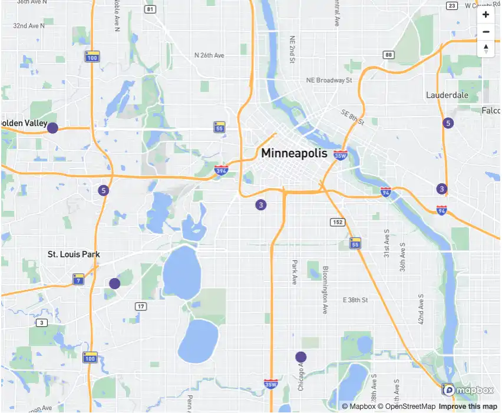
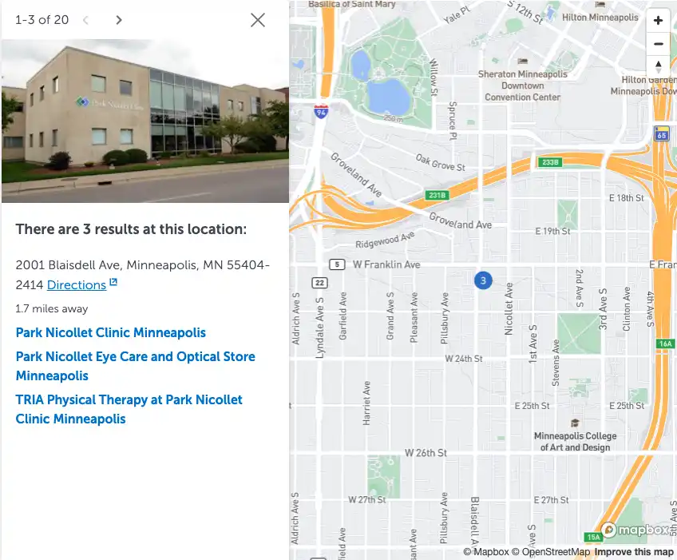

HealthPartners needed their hospital/clinic location search page redesigned to improve discoverability of location information, fix Mapbox map usability, and make the technical architecture more portable.

## Map accessibility

HealthPartners uses Mapbox as the provider of choice to show patients where locations are on a map. The prior implementation of the map had an accessibility problem:

- The map was cluttered with lots of pins that assistive technologies were unable to interact with
- It was difficult to interact with the map on mobile devices with popovers taking too much space and being partially cut off in some cases

I partnered with the accessibility team to design and build several proof of concepts for the map design, with preview links that stakeholders could try live. This enabled an open open discourse about accessibility and UX within the organization, and led to approving a much more accessible product design.

By default, the map loads with a cluster of location pins at a zoom level where all the pins are visible on the map:

When the map receives focus, or a user clicks on a pin on the map a sidebar overlay appears with more information about the location. The map zooms in to provide more context about the highlighted location.

This provides a much more equitable experience for both sighted and assistive technology users. Sighted users can click/drag/scroll through the map with their mouse, while assistive technology users have a sidebar with pagination that they can use to flip through locations.

The location pins are rendered as part of the Mapbox canvas and are not included in the page tab order, which improves map performance while decluttering the tab stops on the page for keyboard users. There's no longer a need to have a tab stop per pin, because the sidebar has controls to navigate through locations.

## Architecture

The page was built using reusable Stencil.js web components, with an event-driven architecture for communicating state changes to subscribed consumers. Using native web components provided flexibility for frontend implementations; the interactive filtering experience can added to JavaScript frontends like React/Vue, or embedded in static HTML pages.
