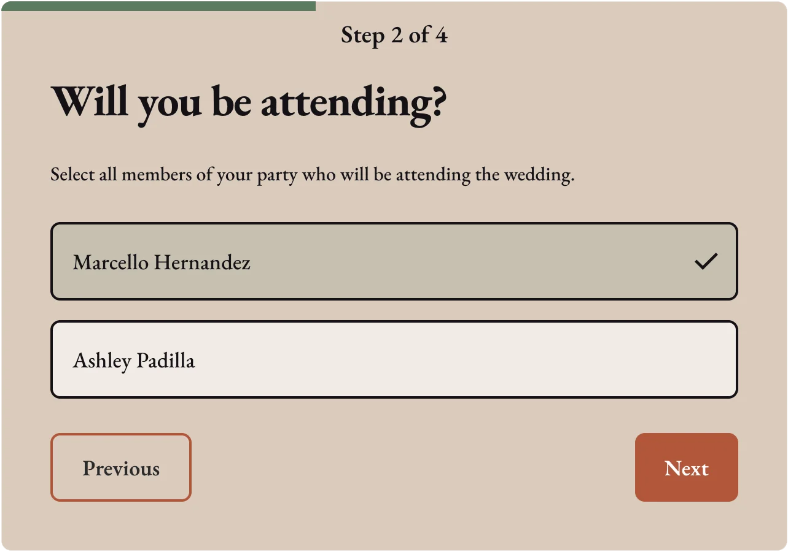
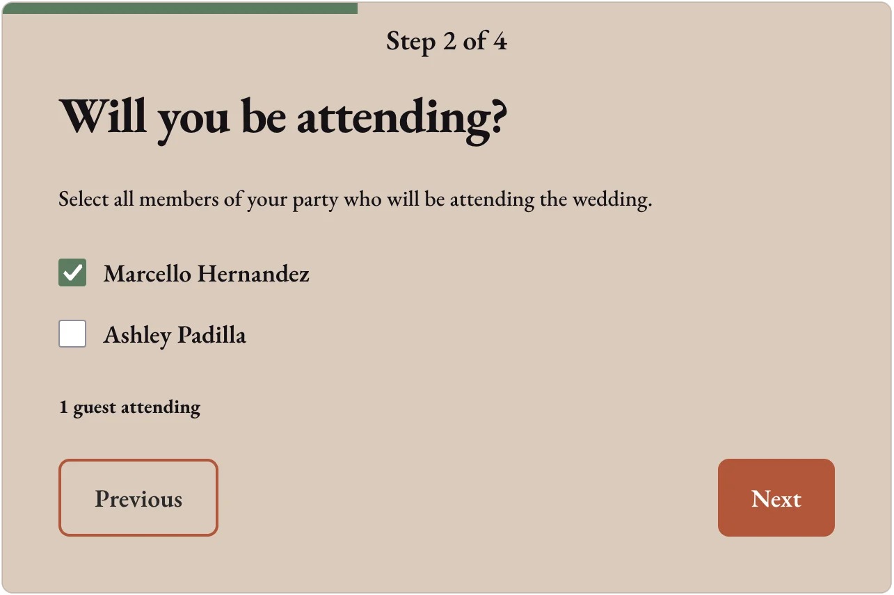

I embarked on building this wedding website with some foundational goals in mind:

- complete creative control over colors, fonts and layouts
- no watermarks or advertising to guests
- protect privacy of guests by not storing their personal information in services like Zola or The Knot
- content should be easily edited in a content management system by both me and my partner
- support mobile push notifications so we can both get excited when someone submits their event RSVP
- both of us can manage guest RSVP responses, add to the guest list, and view guest information like addresses
- purchase a memorable custom domain name that we can use for the site

## Design system

My north star for designing the site was making sure that it's usable and functional for everyone that needs to use it. This means prioritizing the mobile site design, making sure that buttons have large click targets, and making sure that text always has sufficient size and contrast.

The site uses a warm white background with a serif font to make the site feel formal, while still maintaining easy legibility. I avoided cursive scripts - I tend to find them harder to read, despite their traditional look.

There is a warm orange color that's sparingly used for calls to action, such as navigating to the RSVP page, getting directions to the venue, or a link to the hotel booking site.

I love forest green colors, so that had to make an appearance on the site. It was used as the accent color for icons, borders, and visual flares.

## Architecture

The site is hosted on Netlify, Contentful CMS for guest-facing event details, and uses a Postgres database hosted on Neon for guest management.

I chose Contentful CMS because its free plan includes access for up to 2 users, and didn't require me to host any additional CMS management infrastructure. In this case, the less architecture for me to maintain the better.

I also really enjoyed Neon as my database provider, because they included free support for quickly making multiple database "branches". Being able to test database changes in a sandboxed environment to prevent losing production data was a must-have for me, and their scheduled backup feature gave me the peace of mind that I would not lose any guest information.

### Database design at a glance

- **Allowed users**: email addresses authorized to access the site's admin backend
- **Households**: household nicknames, mailing addresses, invitation status, creation and update dates.
- **Guests**: household membership, names, relationship to the household, attendance status, search visibility, creation and update dates.
- **RSVP responses**: household membership, accommodation requests, song recommendations, creation and update dates.

### RSVP considerations

The site frontend and API endpoints are protected by a simple password auth, to prevent bad actors from getting private details about our event or fuzzing the RSVP endpoints for guest information. Only the minimum information needed to show RSVP UI are returned from the API - for example, no guest address information is included in the API responses as clients are interacting with the RSVP form.

RSVP lookups are done by exact name match, and previous RSVP responses can be modified by going through the RSVP flow again. Our wedding is small enough that I didn't feel the need to provide guest with private codes to prevent guests from filling out the form for someone else. This model inherently assumes that names are unique identifiers, which is true for our guest list.

RSVP push notifications are handled via a webhook to my Home Assistant server. My partner and I both have the app already installed on our phone, so this didn't require us to install anything new on our mobile devices.

The flow works as follows:

1. User submits RSVP
2. Webhook POST to Home Assistant with guest's first name, and RSVP status
3. Home Assistant sends a push notification to both of our phones with a summary: "New RSVP: John 🟢"

## Administration

The admin panel uses OIDC for authentication via Zitadel, and it supports managing the following details:

- quick view of how many guests are attending, not attending, and have not responded
- creating "households" (groupings of guests at the same physical address),
- updating household addresses and tracking whether an invite has been sent to the household
- updating individual guest attendance
- viewing guest special accommodation requests and song requests from their RSVP submissions

## Learnings

My takeaways after maintaining this wedding site for about 6 months.

### Analytics

I initially thought that we would like having analytics to see what kind of traffic the site was bringing in, and give us a little insight into what kinds of user agents people were using to view the site. So, I added a simple [GoatCounter](https://www.goatcounter.com/) open source analytics for a free solution to get basic analytics without tracking too much data about our guests. (side note: it's an awesome project that's super easy to set up!)

Turns out, we never used these insights at all over the course of our wedding planning process and I decided to remove the tracking from the page altogether. It did confirm my assumption that most traffic to the site would come from mobile devices though - about 70% of traffic to the site was from iOS and Android devices.

### Interactions with the site are generally transactional

One of the features that I was excited to include on the site was a "memories" submission feature, where guest could choose to submit a story along with their name optionally. Submissions are private, and the stories could be viewed from the admin backend by authorized users.

Not a single person used this! There was probably a couple of factors contributing to this. For one, I don't think the language in the form communicated well enough that these stories were only intended for our private enjoyment, and would never be shared anywhere at the wedding. But the larger factor is likely that guests are usually on the site for a quick transactional purpose. Get information about the schedule, hotels, travel, or RSVP. Filling out a form with a story requires thoughtful time to pause, think about a story to share, and type out long form text on a mobile device keyboard. No thank you!

I ended up choosing to remove this feature, to reduce the amount of code to maintain for the site and reduce clutter from the guest-facing event information.

### Multiple steps in the RSVP form add friction

The RSVP form took 4 steps:

1. Look up your guest information by name
2. Indicate attendance yes/no for all members of your household
3. Optionally provide details about any special accommodations you may need
4. Optionally provide song/artist/music recommendations for the wedding

I ended up hearing from several guests that the music recommendation step caused them to put off submitting their RSVP until later, to give time to think about the perfect song. My partner and I ended up having a lot of fun going through what people submitted, but it had the downside of adding extra friction to the RSVP flow.

### RSVP UX confusion

After publishing the site and including the link to the site in our wedding invites, I had to sit and wait to see RSVPs start to roll in. It didn't take long to identify a problem. We were talking to a friend who was stoked to attend the wedding, and immediately went to submit their RSVP on the website. To my surprise, the RSVP came in as a "No". This was confirmed by a couple of other guests submitting their RSVP in pairs - first submitting a "No", then updating their RSVP to a "yes". I had a UX problem.

Here's what the original RSVP UX looked like:

I had decided to build fancy styled checkboxes. By default this form step loaded with the checkboxes unchecked, which shows up as an empty white box. Without interacting with the form it was hard to tell if the boxes are checked or not.

I decided to pivot, and adjusted this step of the form:

There were a couple of key changes: using standard checkboxes that people are already familiar with, and adding text underneath indicating how many guests are selected to attend the wedding. After releasing this change, I stopped seeing the pattern of guests submitting their RSVPs twice.
